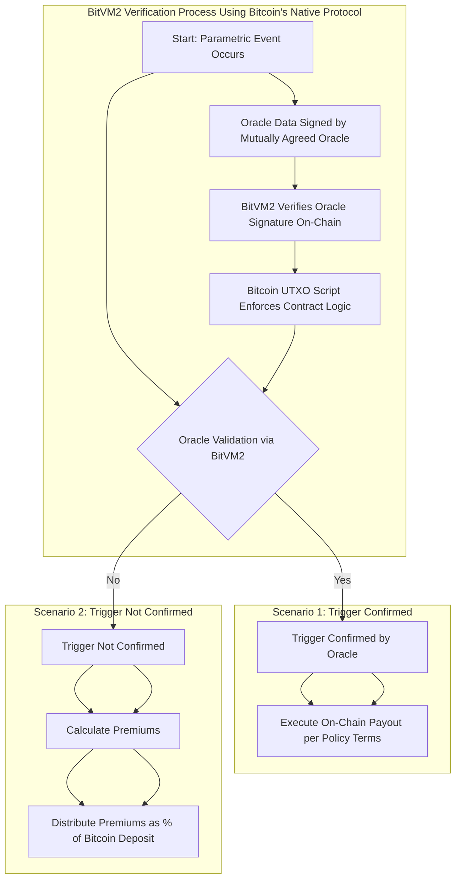

<center>
<h1> SunRe: BitVM2 for Reinsurance </h1>
</center>

Adaptation of the BitVM2 protocol for securing Reinsurance Capacity to help communities around the world withstand climate disasters.

- Credit to Nero's BitVM2 Protocol implementation originally at [distributed-lab/nero](https://github.com/distributed-lab/nero)

# SunRe's Reinsurance Smart Contract

## Overview

This project demonstrates a novel reinsurance smart contract implementation using BitVM2 on the Bitcoin blockchain. It showcases how complex financial instruments can be created on Bitcoin by leveraging off-chain computations with on-chain verification, all while utilizing Bitcoin's native protocol for enhanced security and traceability.

## Key Features

- **Bitcoin-based reinsurance contract with yield generation**
- **Off-chain risk assessment and yield calculations**
- **On-chain verification of off-chain computations via BitVM2**
- **Dynamic premium and coverage calculations**
- **Claim processing and contract state management**
- **Use of mutually agreed upon oracles within Bitcoin's native protocol**

## Novel Mechanisms in SunRe's Reinsurance Protocol

SunRe's reinsurance protocol introduces several innovative mechanisms that enhance the traditional reinsurance process by leveraging blockchain technology, off-chain computations, and Bitcoin's native functionalities. Here are the key mechanisms and their benefits:

1. **Parametric Triggers with Mutually Agreed Oracles**:
   - SunRe's protocol integrates parametric triggers, which are predefined conditions that automatically execute certain actions, such as payouts, based on specific events or data points.
   - These triggers rely on **mutually agreed upon oracles**, ensuring that all parties have consensus on the data sources used for verification.
   - By keeping the verification process within Bitcoin's native protocol, the system enhances security and traceability, as all actions are recorded on-chain and are immutable.
   - *Example*: A parametric trigger could automatically initiate a payout if a weather event, like a hurricane reaching Category 5 status, is confirmed by a trusted weather oracle agreed upon by all parties.

2. **Dynamic Yield Generation**:
   - The protocol supports dynamic yield generation through integration with multi-chain smart contracts.
   - This allows the reinsurance pool to generate yield based on the specific needs and risk profiles of the reinsurance business case.
   - By leveraging smart contracts on different blockchains, SunRe can optimize yield generation strategies and offer competitive premiums and coverage options.

3. **Off-Chain Computations with On-Chain Verification via BitVM2**:
   - SunRe utilizes **BitVM2** to perform complex computations off-chain, such as risk assessment, yield calculations, and claim verification, reducing on-chain computational load and costs.
   - Results of these off-chain computations are cryptographically verified on-chain using BitVM2, ensuring trustless execution within Bitcoin’s UTXO model.
   - BitVM2 enables a truly native reinsurance protocol on Bitcoin by allowing sophisticated contract logic without requiring changes to the Bitcoin protocol or relying on external platforms.

4. **Flexible Reinsurance Capacity and Premiums**:
   - The protocol allows users to set reinsurance capacity and premiums based on their specific requirements.
   - Users can deposit BTC into the reinsurance pool and receive a proportional share of the premiums and yield generated.

5. **Integration with Oracles within Bitcoin's Native Protocol**:
   - SunRe integrates with both on-chain and off-chain oracles, mutually agreed upon by all parties, to obtain real-time data for parametric triggers.
   - By keeping oracle verification within Bitcoin's native protocol using BitVM2, the system ensures enhanced security, transparency, and traceability.

## How It Works with BitVM2

This contract utilizes BitVM2’s capabilities to perform complex computations off-chain while maintaining the security and trustlessness of the Bitcoin blockchain. BitVM2 enables sophisticated smart contract functionality natively on Bitcoin, which was not possible before, without altering the Bitcoin protocol or requiring additional layers. Key aspects include:

1. **Off-Chain Computation with On-Chain Security**:
   - Complex operations like risk assessment, yield calculation, and claim verification are performed off-chain for efficiency.
   - BitVM2 allows these off-chain computations to be securely verified on-chain, ensuring that only valid results agreed upon by all parties are accepted.

2. **On-Chain Verification Using Mutually Agreed Oracles**:
   - Results from mutually agreed upon oracles are verified on-chain via BitVM2.
   - By leveraging Bitcoin's native opcodes and BitVM2's capabilities, the protocol can securely validate oracle data without compromising the security or traceability of the network.

3. **Utilization of Bitcoin's Native Protocol for Security and Traceability**:
   - All transactions and verifications are conducted within Bitcoin's native protocol, enhancing security and transparency.
   - The use of the UTXO model and Bitcoin's scripting language ensures that all actions are immutable and traceable on the blockchain.

4. **State Management and Contract Logic Enforced On-Chain**:
   - The contract state is updated based on verified off-chain computations.
   - BitVM2 enables the enforcement of complex contract logic within Bitcoin's existing framework, without the need for additional layers or protocols.

By leveraging BitVM2, SunRe can create a truly native reinsurance protocol on Bitcoin, enabling sophisticated financial instruments and contracts that were not possible before.

## Native Bitcoin Functionality Leveraged by BitVM2

1. **Signature Verification Using Bitcoin's Native Opcodes**:
   - BitVM2 uses native Bitcoin operations like `OP_CHECKSIG` and `OP_CHECKMULTISIG` to verify signatures from mutually agreed upon oracles.
   - This ensures that parametric triggers and oracle data are validated using Bitcoin's built-in cryptographic mechanisms, maintaining high security and trustlessness.

2. **Trustless Execution within Bitcoin's UTXO Model**:
   - The protocol leverages Bitcoin’s UTXO (Unspent Transaction Output) model to enforce contract logic and manage state transitions.
   - By operating within the UTXO model, the protocol ensures that all transactions are immutable, transparent, and traceable on the Bitcoin blockchain.

3. **On-Chain Payouts and Premium Distributions**:
   - Upon verification of a parametric trigger event (e.g., a natural disaster confirmed by an agreed oracle), BitVM2 enables the protocol to execute payouts directly on-chain in BTC.
   - If the trigger event is not confirmed, premiums are calculated and distributed automatically, leveraging Bitcoin's scripting capabilities.

By integrating BitVM2 with Bitcoin's native functionalities, SunRe ensures the highest level of decentralization, security, and trustlessness in its reinsurance contracts, providing a solution that was previously unattainable within the constraints of Bitcoin's original protocol.

## Flowchart: SunRe Reinsurance Process

To better illustrate the core concepts and ensure consistency, the following flowchart outlines the SunRe reinsurance process leveraging BitVM2 and Bitcoin's native functionalities:



## Setup and Testing

### Prerequisites

- Rust programming environment
- Bitcoin-related crates (as specified in the `use` statements)

### Running the Tests

1. Clone the repository
2. Navigate to the project directory
3. Run the tests using Cargo:

## :file_folder: Contents

The project contains multiple crates:

| Crate | Description |
| --- | --- |
| [bitcoin-splitter](bitcoin-splitter/README.md) | A crate for splitting the Bitcoin script into multiple parts as suggested by the recent [^1]). |
| [bitcoin-winternitz](bitcoin-winternitz) | Winternitz Signature and recovery implementation based on BitVM's [`[signatures]`](https://github.com/BitVM/BitVM/tree/main/src/signatures) package. |
| [bitcoin-utils](bitcoin-utils) | Helper package containing implementation of certain fundamental operations and debugging functions. |
| [bitcoin-testscripts](bitcoin-testscripts) | A collection of test scripts for testing BitVM2 concept. |
| [bitcoin-scriptexec](bitcoin-scriptexec) | A helper crate for executing Bitcoin scripts. Fork of [BitVM package](https://github.com/BitVM/rust-bitcoin-scriptexec). |

## Setting up a Local Bitcoin Node

```shell
docker compose up -d
```

> [!WARNING]
> Sometimes Docker Compose may fail at step of creating the volumes, the most simple solution is, in regards of failure, just trying starting it again several times until it works.

Let us create a temporary alias for `bitcoin-cli` from the container like this:

```shell
alias bitcoin-cli="docker compose exec bitcoind bitcoin-cli"
```

Create a fresh wallet for your user:

```shell
bitcoin-cli createwallet "my"
```

> [!WARNING]
> Do not create more than one wallet, otherwise further steps would require
> a bit of modification.

Generate fresh address and store it to environmental variable:

```shell
export ADDRESS=$(bitcoin-cli getnewaddress "main" "bech32")
```

Then mine 101 blocks to your address:

```shell
bitcoin-cli generatetoaddress 101 $ADDRESS
```

> [!NOTE]
> Rewards for mined locally blocks will go to this address, but, by protocol rules, BTCs are mature only after 100 confirmations, so that's why 101 blocks are mined. You can see other in  `immature` balances fields, after executing next command.
>
> For more info about Bitcoin RPC API see [^2].

```shell
bitcoin-cli getbalances
```

## Examples

The `examples` folder contains a test script `sunre_test.rs` that allows setting reinsurance capacity and premiums paid, and demonstrates depositing BTC for a portion of yield. This script includes functions for verifying the contract and generating valid and invalid input-output pairs.

[^1]: https://bitvm.org/bitvm_bridge.pdf
[^2]: https://developer.bitcoin.org/reference/rpc/
