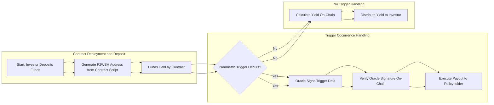

<center>
<h1> SunRe: Native Reinsurance on Bitcoin with BitVM2 </h1>
</center>

Adaptation of the BitVM2 protocol for securing Reinsurance Capacity, leveraging Bitcoin's native capabilities to help communities worldwide withstand climate disasters.

- **Credit**: Based on Nero's BitVM2 Protocol implementation originally at [distributed-lab/nero](https://github.com/distributed-lab/nero)

# SunRe's Reinsurance Smart Contract

## Overview

SunRe introduces a novel reinsurance smart contract implemented natively on the Bitcoin blockchain using **BitVM2**. This project demonstrates how complex financial instruments, such as reinsurance contracts, can be executed directly on Bitcoin without relying on external platforms or tokens. By leveraging Bitcoin's native protocol and BitVM2, SunRe enables secure, transparent, and trustless reinsurance capacity, helping communities around the world mitigate the financial impact of climate disasters.

## Key Features

- **Native Bitcoin Reinsurance Contract**: Utilizes Bitcoin's scripting capabilities for reinsurance agreements.
- **Parametric Triggers with On-Chain Verification**: Automates payouts based on predefined events, verified on-chain.
- **Yield Generation for Investors**: Provides returns to investors when no claims are made.
- **Maximized On-Chain Verification**: Ensures security and trustlessness by performing critical verifications on-chain.
- **Secure Deposit Address Generation**: Uses Bitcoin's P2WSH addresses derived from the contract script for secure fund deposits.
- **Transparent and Auditable**: Open-source code allows for independent verification and auditing.

## How SunRe Utilizes BitVM2 for Native Bitcoin Reinsurance

### 1. Native Smart Contract Execution with BitVM2

SunRe leverages **BitVM2** to execute complex smart contract logic directly on the Bitcoin blockchain. BitVM2 enhances Bitcoin's scripting capabilities, enabling more sophisticated contracts without altering the Bitcoin protocol or requiring external platforms.

- **On-Chain Enforcement**: The reinsurance contract logic is enforced directly by the Bitcoin network.
- **No External Tokens**: Operates solely with BTC, maintaining Bitcoin's purity and reducing risk.

### 2. Parametric Triggers with On-Chain Verification

Parametric triggers are predefined conditions that, when met, automatically execute contract actions such as payouts. SunRe's implementation includes:

- **Oracle Integration**: Utilizes mutually agreed-upon oracles to provide data on trigger events (e.g., natural disasters).
- **On-Chain Signature Verification**: Verifies oracle signatures on-chain using Bitcoin's native opcodes (`OP_CHECKSIG`), ensuring data authenticity.
- **Automated Payouts**: Executes payouts to policyholders or yield distributions to investors based on trigger evaluation.

### 3. Maximizing On-Chain Verification

SunRe's contract is designed to perform as much verification as possible on-chain, enhancing security and trustlessness.

- **Investment Verification**: Ensures investments meet minimum requirements.
- **Yield Calculation**: Calculates yields on-chain, reducing reliance on off-chain computations.
- **State Management**: Updates contract state directly on-chain based on verified data.

### 4. Secure Deposit Process

Investors can securely deposit Bitcoin into the reinsurance contract via a P2WSH (Pay-to-Witness-Script-Hash) address derived from the contract script.

- **Address Generation**: The contract script is hashed to produce the P2WSH address.
- **Investor Trust**: Investors can independently verify the address corresponds to the contract, ensuring funds are controlled by the contract logic.

## Detailed Flow of SunRe's Reinsurance Process

Below is an enhanced flowchart illustrating SunRe's reinsurance process, reflecting the details of the script and designed with a left-to-right flow.


## Setup and Testing

### Prerequisites

- Rust programming environment
- Bitcoin-related crates (as specified in the `use` statements)

### Running the Tests

1. Clone the repository
2. Navigate to the project directory
3. Run the tests using Cargo:

## :file_folder: Contents

The project contains multiple crates:

| Crate | Description |
| --- | --- |
| [bitcoin-splitter](bitcoin-splitter/README.md) | A crate for splitting the Bitcoin script into multiple parts as suggested by the recent [^1]). |
| [bitcoin-winternitz](bitcoin-winternitz) | Winternitz Signature and recovery implementation based on BitVM's [`[signatures]`](https://github.com/BitVM/BitVM/tree/main/src/signatures) package. |
| [bitcoin-utils](bitcoin-utils) | Helper package containing implementation of certain fundamental operations and debugging functions. |
| [bitcoin-testscripts](bitcoin-testscripts) | A collection of test scripts for testing BitVM2 concept. |
| [bitcoin-scriptexec](bitcoin-scriptexec) | A helper crate for executing Bitcoin scripts. Fork of [BitVM package](https://github.com/BitVM/rust-bitcoin-scriptexec). |

## Setting up a Local Bitcoin Node

```shell
docker compose up -d
```

> [!WARNING]
> Sometimes Docker Compose may fail at step of creating the volumes, the most simple solution is, in regards of failure, just trying starting it again several times until it works.

Let us create a temporary alias for `bitcoin-cli` from the container like this:

```shell
alias bitcoin-cli="docker compose exec bitcoind bitcoin-cli"
```

Create a fresh wallet for your user:

```shell
bitcoin-cli createwallet "my"
```

> [!WARNING]
> Do not create more than one wallet, otherwise further steps would require
> a bit of modification.

Generate fresh address and store it to environmental variable:

```shell
export ADDRESS=$(bitcoin-cli getnewaddress "main" "bech32")
```

Then mine 101 blocks to your address:

```shell
bitcoin-cli generatetoaddress 101 $ADDRESS
```

> [!NOTE]
> Rewards for mined locally blocks will go to this address, but, by protocol rules, BTCs are mature only after 100 confirmations, so that's why 101 blocks are mined. You can see other in  `immature` balances fields, after executing next command.
>
> For more info about Bitcoin RPC API see [^2].

```shell
bitcoin-cli getbalances
```

## Examples

The `examples` folder contains a test script `sunre_test.rs` that allows setting reinsurance capacity and premiums paid, and demonstrates depositing BTC for a portion of yield. This script includes functions for verifying the contract and generating valid and invalid input-output pairs.

[^1]: https://bitvm.org/bitvm_bridge.pdf
[^2]: https://developer.bitcoin.org/reference/rpc/
